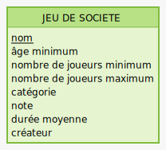

# Portfolio jeux de société

## Description

J'ai créé ce projet afin de pouvoir gérer ma collection de jeux de société.

## Réalisation

J'ai codé ce projet en 2jrs environ, dans le cadre de la spécialisation API, de ma formation Développeur Fullstack JavaScript.
J'ai tout d'abord commencé par la partie back : base de données relationnelles (SQL), mise en place de l'API.
J'ai utilisé l'approche Active Record.

## Langages utilisés

- JavaScript
- SQL

## Stack

- Node 10+
  - Express
  - Joi
- PostgreSQL 11+
  - Sqitch
- JSDoc
  - Swagger

## Documentation

J'ai documenté le projet à l'aide de ```JSDoc``` et du module ```express-swagger-generator```.

La documentation sera visible à l'adresse ```http://<app_host>:<app_port>/api-docs```.

## Structure des données

Pour la v1, je n'ai implémenté qu'une seule table.



## Installation

### Cloner le repository

Si vous avez une clé SSH :

Sinon, en utilisant HTTPS :

### Installer les dépendances

```npm install```

### Créer une base de données

### Charger la table via Sqitch avec la commande

```sqitch deploy db:pg:<nom de la base de données>```

### Créer un fichier .env à la racine du projet

Reprendre les informations demandées citées dans [le fichier .env.example](./.env.example)

### Importer les données

```psql -d <nom de la base de données> -f ./data/import_data.sql```

### Pour démarrer l'application, lancer le script

```npm start```

### Utilisation

Pour tester côté back, je préconise [l'extension VSCode "Rest Client"](https://marketplace.visualstudio.com/items?itemName=humao.rest-client)

Vous pourrez par exemple utiliser [le fichier api.http](./api.http).

<!-- ## Licence

Ce projet est sous licence MIT - voir le fichier LICENSE pour plus de détails. -->